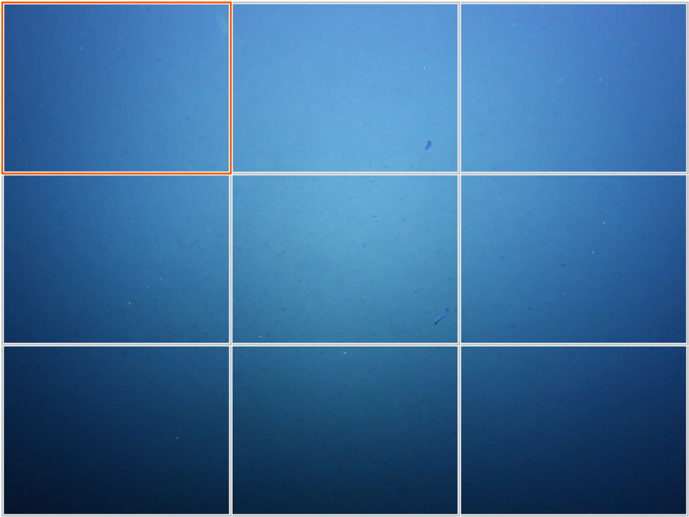

# Regular Sampling Grid

Create annotations that form a regular grid for all images of a volume.

A regular grid may be useful in some cases of area coverage estimation. To avoid aliasing effects [random point sampling](https://biigle.de/manual/tutorials/annotations/navigating-images#random-sampling) is preferrable in most cases, though.

## Installation

This script expects the [API wrapper script](/api) in a sibling directory (like in this repository). You can also replace the [api.py](api.py) link with the actual file.

## Usage

Set the following variables at the top of the script:

- `email`: The email address of the user who should be the creator of the grid annotations.
- `token`: [API token](https://biigle.de/settings/tokens) of the user.
- `volume_id`: ID of the volume where the grid annotations should be created. You can find the volume ID in the URL bar of your browser. Example: `https://biigle.de/volumes/464` is the volume with ID 464.
- `label_id`: ID of the label to attach to the grid annotations. You can find the ID of a label in the JSON output of the label tree API endpoint. Try `https://biigle.de/api/v1/label-trees/1`.
- `rows`: The number of rows of the regular grid.
- `columns`: The number of columns of the regular grid.
- `assume_same_dimension`: Set this to `False` if the images of the volume do not all have the same dimensions.

The result is a grid of rectangle annotations for each image of the volume. Use the [volume label review mode](https://biigle.de/manual/tutorials/annotations/navigating-images#volare) to efficiently step through all rectangles. Example:

